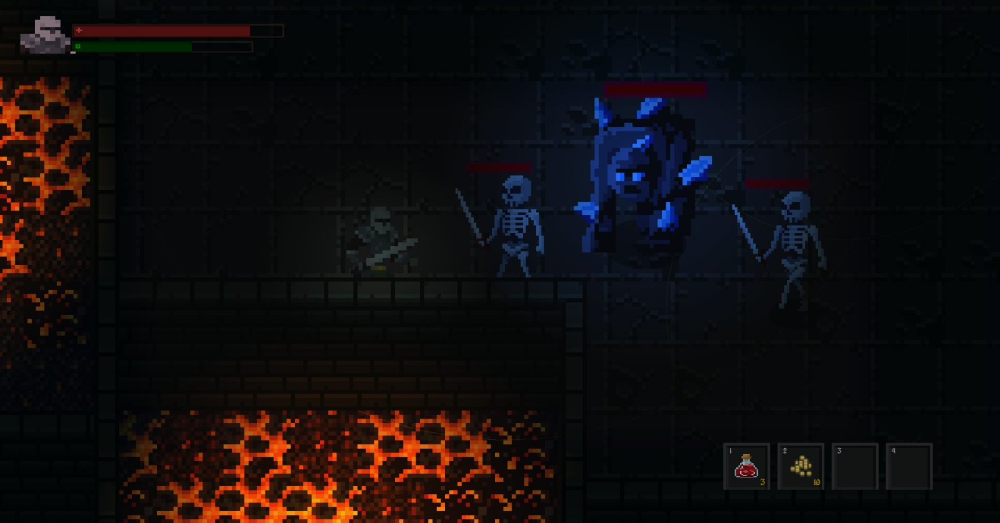

# Dungeon Crawler

A dark fantasy dungeon crawler built with Godot 4. Descend into a cursed dungeon, fight the undead, collect gold, and face the final boss.

## Gameplay

- Explore a hand-crafted dungeon with secret rooms and hidden paths
- Fight skeletons, golems, and a powerful final boss
- Collect gold from enemies and spend it at the prisoner merchant
- Manage your health and stamina — every hit counts
- Find chests with potions and items to aid your survival

## Controls

| Action | Key |
|---|---|
| Move | WASD |
| Attack | Left Mouse Button |
| Roll | Space |
| Sprint | Shift |
| Interact | F |
| Pause | Escape |
| Zoom | Mouse Wheel |

## Features

- Dynamic lighting and atmosphere
- Enemy AI with pathfinding and state machine
- Stamina system affecting movement and combat
- Inventory and hotbar system
- Secret rooms with unique encounters
- Gold drop and merchant system
- Boss fight with multiple attack patterns

## Built With

- [Godot 4](https://godotengine.org/)
- Pixel art assets from [itch.io](https://itch.io/game-assets)

## Status

Currently in development. First release coming soon on itch.io.