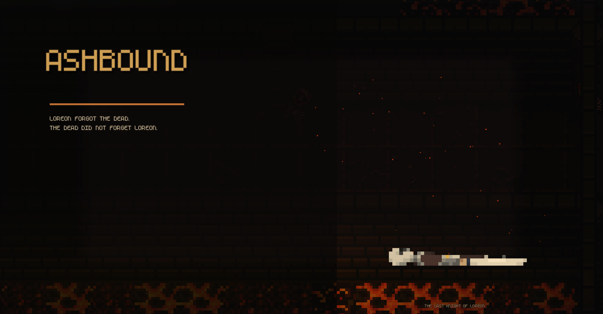
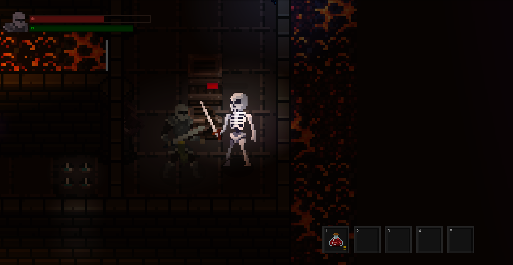
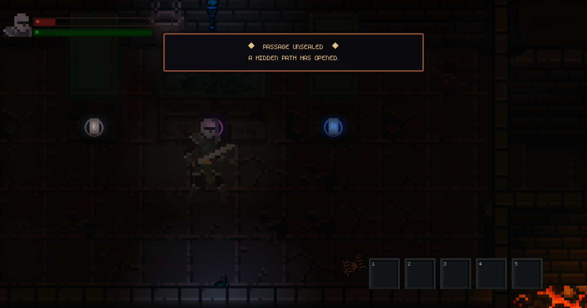
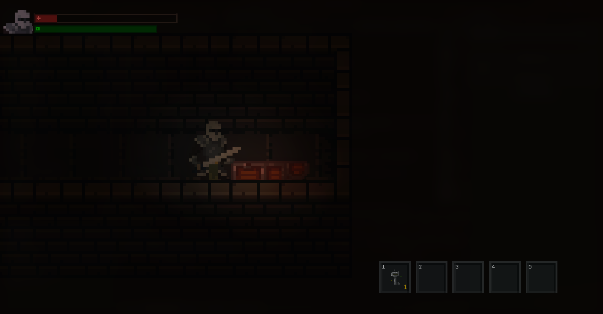
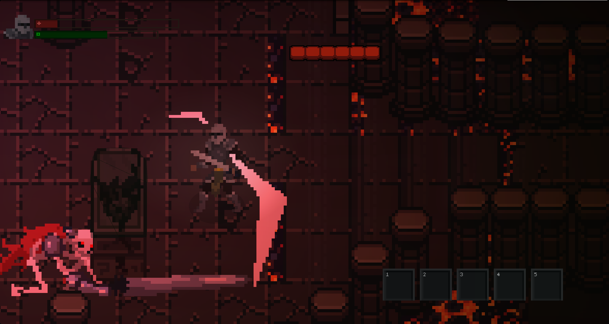

# Dungeon Crawler

A dark fantasy dungeon crawler built with Godot 4. Descend into Loreon's cursed ruins, recover the runes, and face the final guardian.

## Gameplay

- Explore a hand-crafted dungeon with secret rooms, rune trials, and hidden paths
- Fight skeletons, golems, and a powerful final boss
- Manage your health and stamina — every hit counts
- Find the Corrupted Key to unlock the sealed boss corridor

## Screenshots

| Exploration | Combat |
|---|---|
|  |  |

| Hidden passage | Secret room |
|---|---|
|  |  |

| Final boss | HUD |
|---|---|
|  |  |

## Controls

| Action | Key |
|---|---|
| Move | WASD |
| Attack | Left Mouse Button |
| Roll | Space |
| Sprint | Shift |
| Interact | F |
| Pause | Escape |
| Zoom | Mouse Wheel |

## Features

- Dynamic lighting and atmosphere
- Enemy AI with pathfinding and state machine
- Stamina system affecting movement and combat
- Inventory and hotbar system
- Secret rooms with unique encounters
- Rune puzzle that opens the hidden route
- Boss fight with multiple attack patterns

## Built With

- [Godot 4](https://godotengine.org/)
- Pixel art assets from [itch.io](https://itch.io/game-assets)

## Status

Currently in development. First release coming soon on itch.io.
